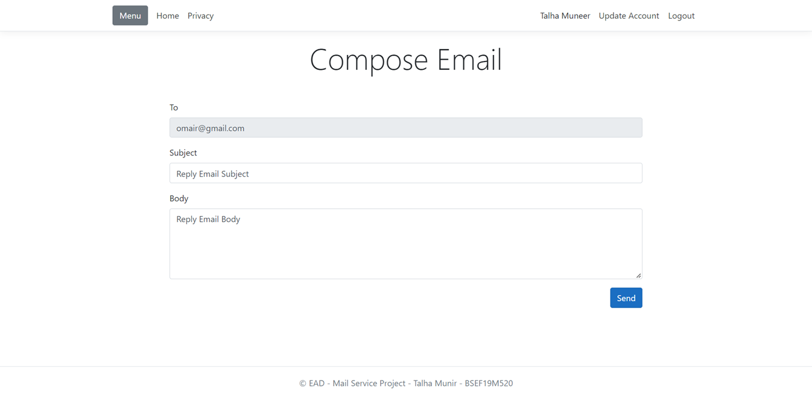
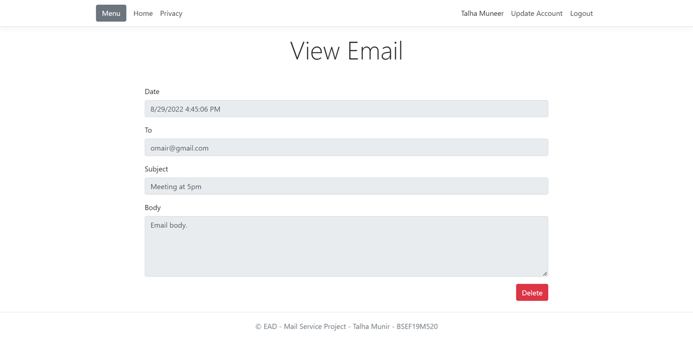

# Virtual Mail

**Virtual Mail** is a web-based application developed using ASP.NET Core that allows users to send and receive emails within the platform, simulating an email client experience. The project does not use traditional email protocols like IMAP or POP3 but instead mocks the functionalities of an email service. The frontend is designed using Bootstrap CSS, and the backend leverages PostgreSQL for data storage.

## Features

- **User Registration and Authentication:** Users can register and log in to their accounts.
- **Inbox Management:** Users can view their received emails, including sender information, subject, and timestamp.
- **Email Composition:** Users can compose and send new emails to other registered users.
- **View and Reply to Emails:** Users can view detailed emails and reply directly from the interface. The "To" field in replies is auto-populated and read-only.
- **Sent Emails Management:** Users can view a list of sent emails and their details.
- **Email Deletion:** Emails can be deleted from the inbox.

## Technologies Used

- **ASP.NET Core:** Backend framework for building the web application.
- **Bootstrap CSS:** Frontend framework for responsive and modern UI design.
- **PostgreSQL:** Database system for storing user data and emails.
- **IIS Express:** Hosting the application for development purposes.

## Installation and Setup

### Prerequisites

- **PostgreSQL 14**: Download and install from [here](https://www.enterprisedb.com/downloads/postgres-postgresql-downloads).
- **Visual Studio**: For running and debugging the project.

### Steps

1. **Start the PostgreSQL Server:**
   - Ensure that your PostgreSQL server is running.

2. **Set Up the Database:**
   - Open a terminal in the project directory and run the following command to set up the database:
     ```bash
     psql -U [username] -d EADProject < EADProject.sql
     ```
   - Replace `[username]` with your PostgreSQL username.

3. **Modify the Connection String:**
   - Update the database connection string in `Models/DatabaseConnection.cs` with your PostgreSQL username and password.

4. **Run the Application:**
   - Start the application using IIS Express available in Visual Studio.

## Usage

- **Register and Login:**
  - Users must first register an account and then log in to access their inbox and other features.
  
- **Inbox:**
  - Upon successful login, users are directed to the inbox where they can view received emails.

- **Compose and Send Emails:**
  - Users can compose new emails and send them to other registered users on the platform.

- **Reply to Emails:**
  - Users can reply to received emails directly from the email view page.

- **View Sent Emails:**
  - Users can access the list of sent emails to review what they’ve sent.

## Screenshots
### Register


### Login


### Update Account


### Inbox


### View Received Email


### Reply


### Menu


### Compose Email


### Sent Emails


### View Sent Email


## Contributing

If you'd like to contribute to this project, feel free to open a pull request or report any issues you find. Contributions are welcome!

## License

This project is licensed under the MIT License - see the [LICENSE](LICENSE) file for details.